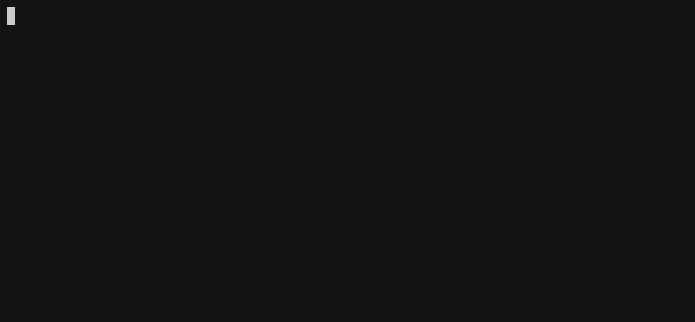
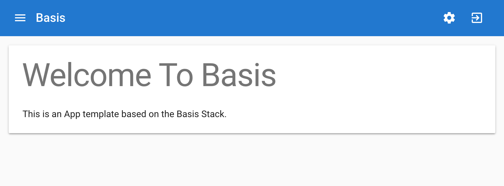

Cool CLI interface! :sunglasses:



Lets check out the directory.

```
.
├── config
│   ├── build.config.js
│   ├── nginx.conf
│   ├── settings.default.js
│   ├── settings.development.js
│   ├── settings.local.js
│   ├── settings.production.js
│   ├── theme.js
│   └── webpack.config.js
├── gulpfile.babel.js
├── package.json
├── scripts
│   ├── deploy.sh
│   ├── install_deps.sh
│   ├── install_platform.sh
│   ├── nuke_packages.sh
│   ├── set_node_env.sh
│   ├── set_runtime_dir.sh
│   ├── start.sh
│   └── stop.sh
├── src
│   ├── client
│   │   ├── app.jsx
│   │   ├── components
│   │   │   ├── appBar
│   │   │   │   ├── appBar.jsx
│   │   │   │   └── index.js
│   │   │   ├── index.js
│   │   │   ├── section
│   │   │   │   ├── index.js
│   │   │   │   └── section.jsx
│   │   │   └── slidingPanel
│   │   │       └── slidingPanel.jsx
│   │   ├── index.js
│   │   └── modules
│   │       └── shell
│   │           ├── actions
│   │           │   ├── fetchConfig.js
│   │           │   └── index.js
│   │           ├── components
│   │           │   ├── settingsPanel.jsx
│   │           │   └── shell.jsx
│   │           ├── constants
│   │           │   └── actionTypes.js
│   │           ├── index.js
│   │           └── reducers
│   │               └── index.js
│   └── server
│       ├── assets
│       │   └── styles
│       │       └── main.scss
│       ├── bin
│       │   └── bootstrap.js
│       ├── modules
│       │   └── home
│       │       ├── homeController.js
│       │       └── index.js
│       └── views
│           ├── app.ejs
│           ├── head.ejs
│           └── index.ejs
├── test
│   ├── mocha.opts
│   └── server
│       ├── homeControllerSpec.js
│       └── homeIndexSpec.js
└── tsconfig.json

23 directories, 44 files
```

- `config` directory
  - webpack config found! Looks clean and simple.
  - Oh nginx configuration?
  - Should I mess with the various `settings.*.js`?
- `gulpfile.babel.js` gulpfile written in ES6 :)
- `src`
  - We see client and server directory. Is this both a server and client app?

Check out `package.json`

```json
{
  "name": "awesome-app",
  "version": "0.0.1",
  "license": "MIT",
  "scripts": {
    "build": "eslint config/*.js gulpfile.babel.js && gulp build:full",
    "start": "node dist/bin/start-awesome-app",
    "dev": "cross-env NODE_ENV=development node dist/bin/start-awesome-app",
    "prod": "cross-env NODE_ENV=production node dist/bin/start-awesome-app",
    "test": "cross-env BABEL_ENV=test mocha test/**/*Spec.js",
    "coverage": "cross-env BABEL_ENV=test nyc mocha test/**/*Spec.js"
  },
  "dependencies": {
    "axios": "^0.18.0",
    "basis-client": "^0.0.9",
    "basis-components": "^0.0.10",
    "basis-server": "^0.0.21",
    "basis-testing": "^0.0.3",
    "cors": "^2.8.4",
    "material-ui": "^1.0.0-beta.37",
    "object-assign-deep": "^0.3.1",
    "prop-types": "^15.6.1",
    "react": "^16.2.0",
    "react-jss": "^8.3.5",
    "react-redux": "^5.0.7",
    "react-router-dom": "^4.2.2",
    "react-router-redux": "^5.0.0-alpha.6",
    "redux-thunk": "^2.2.0"
  },
  "devDependencies": {
    "babel-cli": "^6.26.0",
    "babel-core": "^6.26.0",
    "babel-eslint": "^8.2.2",
    "babel-loader": "^7.1.4",
    "babel-plugin-istanbul": "^4.1.5",
    "babel-plugin-rewire": "^1.1.0",
    "babel-plugin-transform-decorators-legacy": "^1.3.4",
    "babel-plugin-transform-object-rest-spread": "^6.26.0",
    "babel-polyfill": "^6.26.0",
    "babel-preset-env": "^1.6.1",
    "babel-preset-react": "^6.24.1",
    "basis-assets": "^0.0.7",
    "basis-build": "^0.0.24",
    "chai": "^4.1.2",
    "chai-enzyme": "^1.0.0-beta.0",
    "cheerio": "^1.0.0-rc.2",
    "colors": "^1.2.1",
    "coveralls": "^3.0.0",
    "cross-env": "^5.1.4",
    "css-loader": "^0.28.11",
    "enzyme": "^3.3.0",
    "enzyme-adapter-react-16": "^1.1.1",
    "eslint": "^4.19.1",
    "eslint-config-airbnb": "^16.1.0",
    "eslint-config-basis-stack": "^0.0.14",
    "eslint-plugin-chai-friendly": "^0.4.1",
    "eslint-plugin-import": "^2.9.0",
    "eslint-plugin-jsx-a11y": "^6.0.3",
    "eslint-plugin-react": "^7.7",
    "gulp": "^3.9.1",
    "mocha": "^5.0.4",
    "nyc": "^11.6.0",
    "react-test-renderer": "^16.2.0",
    "run-sequence": "^2.2.1",
    "sinon": "^4.4.8",
    "style-loader": "^0.20.3"
  }
}
```

- `scripts`
  - `npm run build` - seems like gulp is used here
  - `npm start`, `npm run dev`, `npm run prod` runs the bundled app
  - Would be nice if there is a continous compilation mode out of the box. Maybe
    `npm start` can be used?
  - Defaults to mocha test runner. Would it be easy to switch to jest or jasmine?
  - `npm run coverage` :+1:
- `dependencies`
  - react, redux and material-ui for the UI
  - basis-server for server?

Now lets try running the app.

**npm run build**

```
> awesome-app@0.0.1 build ~/awesome-app
> eslint config/*.js gulpfile.babel.js && gulp build:full

[00:47:57] Failed to load external module @babel/register
[00:47:57] Requiring external module babel-register
[settings] Loaded environment settings for: default, development, local, production
[00:47:58] Using gulpfile ~/awesome-app/gulpfile.babel.js
[00:47:58] Starting 'build:full'...
[00:47:58] Starting 'clean'...
[00:47:58] Finished 'clean' after 49 ms
[00:47:58] Starting 'prepare:build'...
[00:47:58] Finished 'prepare:build' after 520 μs
[00:47:58] Starting 'create:env-settings'...
[00:47:58] Starting 'create:package-json'...
[00:47:58] Starting 'lint:server'...
[00:47:58] Starting 'copy:server:views'...
[00:47:58] Starting 'copy:fonts'...
[00:47:58] Starting 'create:server:theme'...
[00:47:58] Starting 'lint:client'...
[00:47:58] Finished 'create:env-settings' after 72 ms
[00:47:58] Finished 'create:package-json' after 72 ms
[00:47:58] Finished 'create:server:theme' after 42 ms
[00:47:58] Starting 'sass:server'...
[00:47:59] Finished 'lint:server' after 1.15 s
[00:47:59] Starting 'compile:server'...
[00:47:59] Finished 'copy:server:views' after 1.61 s
[00:47:59] Finished 'sass:server' after 1.56 s
[00:47:59] Finished 'compile:server' after 635 ms
[00:48:00] Finished 'lint:client' after 1.88 s
[00:48:00] Starting 'bundle:client'...
[00:48:01] Finished 'copy:fonts' after 3.26 s
[00:48:01] Starting 'build:server'...
[00:48:01] Finished 'build:server' after 35 μs
[00:48:02] Finished 'bundle:client' after 2.25 s
[00:48:02] Starting 'build:client'...
[00:48:02] Finished 'build:client' after 17 μs
[00:48:02] Starting 'build:all'...
[00:48:02] Finished 'build:all' after 2.1 μs
[00:48:02] Starting 'finalise'...
[00:48:02] Finished 'finalise' after 2 ms
[00:48:02] Finished 'build:full' after 4.22 s
npm run build  7.97s user 0.71s system 106% cpu 8.123 total
```

- Build steps may seem a little overwhelming at first.

**npm start**

```
> awesome-app@0.0.1 start ~/awesome-app
> node dist/bin/start-awesome-app

info: [STARTUP] INIT: bootstrapped config for env: LOCAL
info: [STARTUP] INIT: wired routes for module 'home'
info: [SERVER_] START: listening on port 3000
```

http://localhost:3000/



- Clean UI. The navigation header and slide-out drawer looks good.
- Watch mode to hot reload the UI would be nice. (webpack)

Now lets take a look at the UI code.

`src/client/index.js`

```JSX
import React from 'react';
import { initialise } from 'basis-client';
import { core } from 'basis-client/modules';

import theme from './../../config/theme';
import shell from './modules/shell';
import App from './app';

const modules = [
  core.initialise(theme),
  shell.initialise()
];
const app = <App />;

initialise(modules, app);
```

- What does `initialise` actually do?
- Lets check out `<App />`;

`src/client/app.jsx`

```JSX
import React from 'react';
import CssBaseline from 'material-ui/CssBaseline';
import { RootRouter } from 'basis-client/components';

export default ({ routes }) => (

  <div>
    <CssBaseline />
    <RootRouter routes={routes} />
  </div>
);
```

- Might be a good idea to leave a comment about `CssBaseline` here.
- `RootRouter` is from `basis-client/components`. Would it matter which router
  and version it is it referring to?
- Would be good if we have a larger app example (in this or another repo) for
  reference.
- How should we structure the application into modules?

Next, we look at `src/client/modules/shell/index.js` to see what makes up a
module.

```JSX
import { routeTypes } from 'basis-client';

import reducers from './reducers';
import Shell from './components/shell';

export default {

  actions: undefined,
  initialise: () => ({

    key: 'shell',
    route: {
      path: '/',
      component: Shell,
      type: routeTypes.shellHub
    },
    reducers
  })
};
```

- Maybe `key: 'shell'` can be renamed to `namespace: 'shell'`.
- What does `routeTypes.shellHub` mean?

`src/client/modules/shell/components/shell.jsx`

```JSX
import React from 'react';
import { connect } from 'react-redux';
import MuiTypography from 'material-ui/Typography';
import MuiDrawer from 'material-ui/Drawer';

import { AppBar, Section } from './../../../components';
import { fetchConfig, toggleDrawer } from './../actions';
import SettingsPanel from './settingsPanel';

class Shell extends React.Component {

  componentDidMount() {

    if (this.props.config === undefined) {

      this.props.onFetchConfig();
    }
  }

  render() {

    return (

      <div>
        <AppBar onLeftIconClick={() => { console.log('Left icon click'); }}
                onSettingsClick={this.props.onToggleDrawer}
                onLogoutClick={() => { console.log('Logout'); }} />
        <MuiDrawer anchor="right"
                   open={this.props.layout.drawerOpen}
                   onClose={this.props.onToggleDrawer}>
          <SettingsPanel onCancel={this.props.onToggleDrawer}
                         onSave={(data) => { console.log(data); this.props.onToggleDrawer(); }} />
        </MuiDrawer>
        <Section>
          <MuiTypography variant="display3" gutterBottom>
            Welcome To Basis
          </MuiTypography>
          <MuiTypography variant="subheading" gutterBottom>
            This is an App template based on the Basis Stack.
          </MuiTypography>
        </Section>
      </div>
    );
  }
}

const mapDispatchToProps = dispatch => ({

  onFetchConfig: () => { dispatch(fetchConfig()); },
  onToggleDrawer: () => { dispatch(toggleDrawer()); }
});

const mapStateToProps = state => ({

  config: state.core.config,
  layout: state.shell.layout
});

export default connect(mapStateToProps, mapDispatchToProps)(Shell);
```

- We can use the shorthand for `mapDispatchToProps`:

```javascript
const mapDispatchToProps = {
  onFetchConfig: fetchConfig,
  onToggleDrawer: toggleDrawer,
};
```
